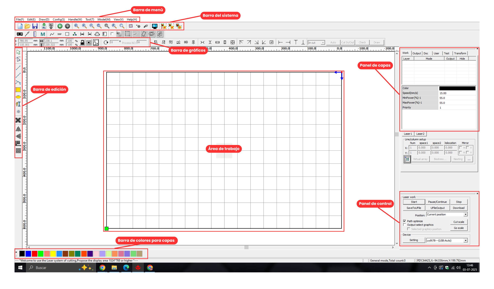
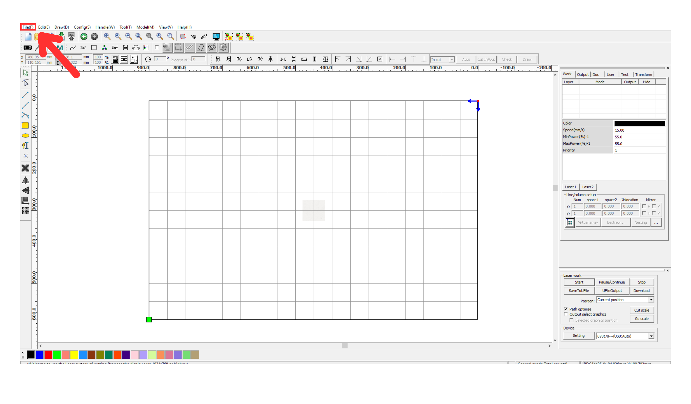
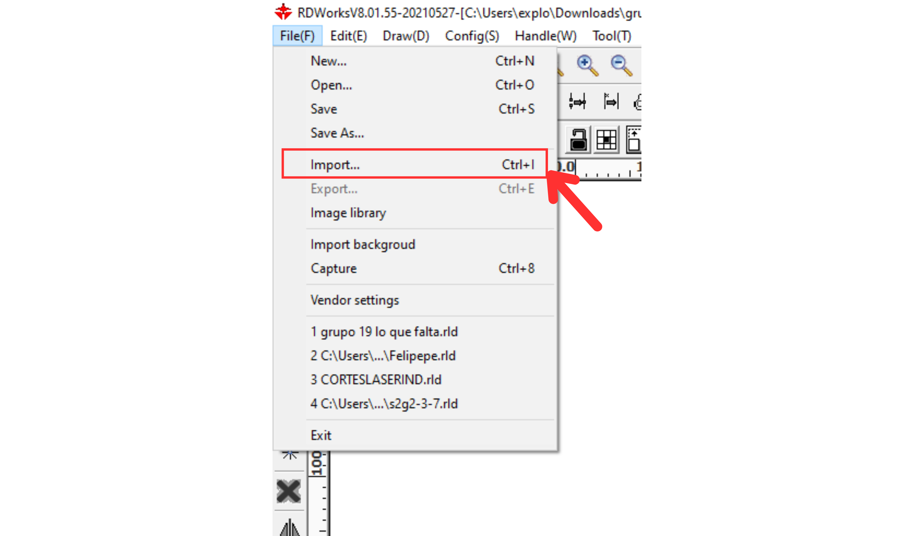
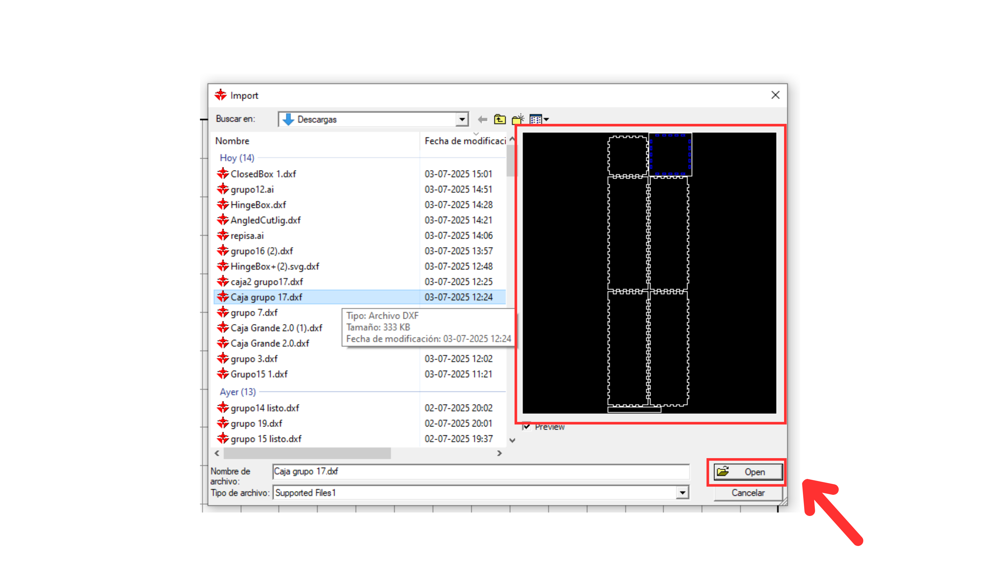
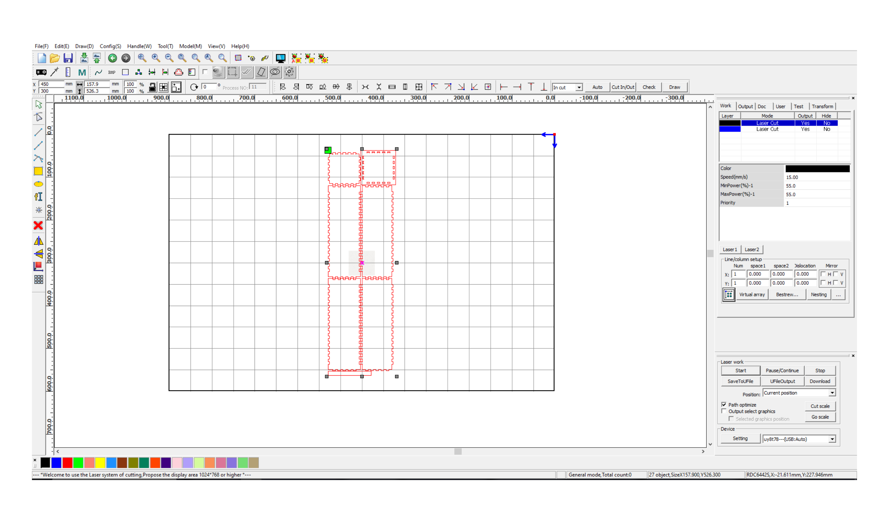
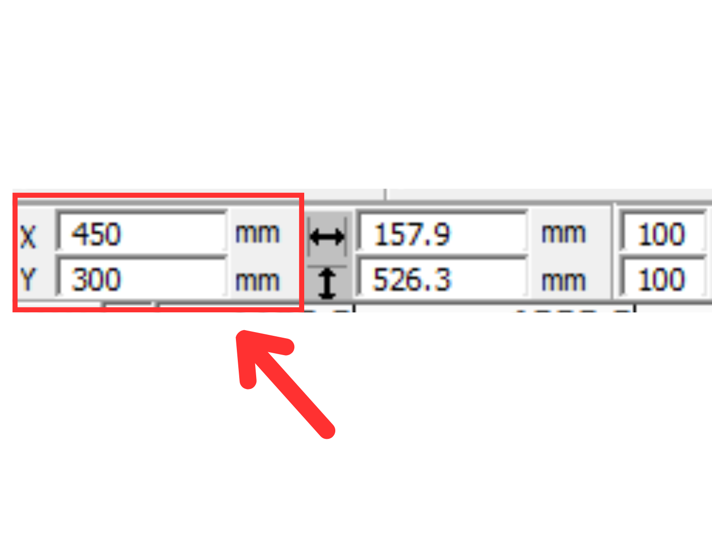
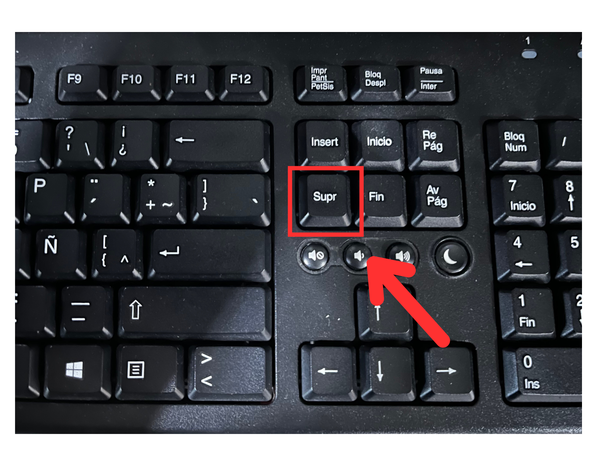
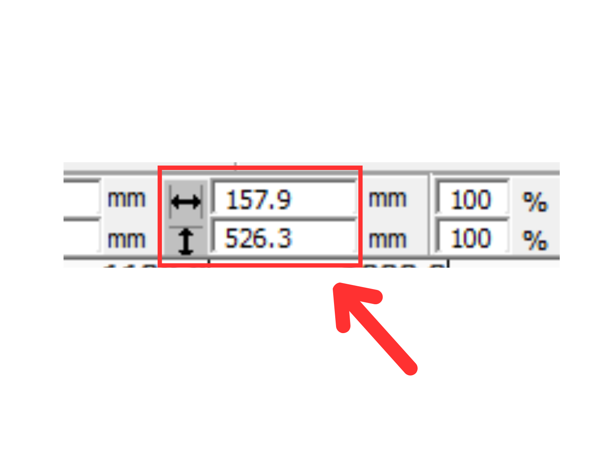
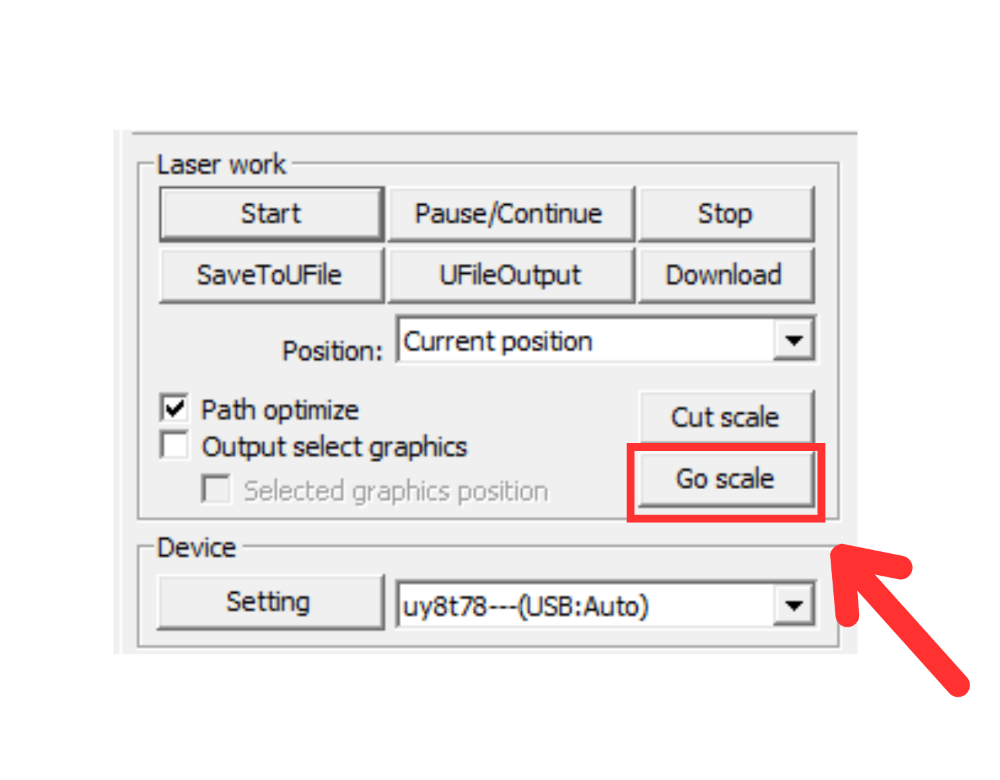
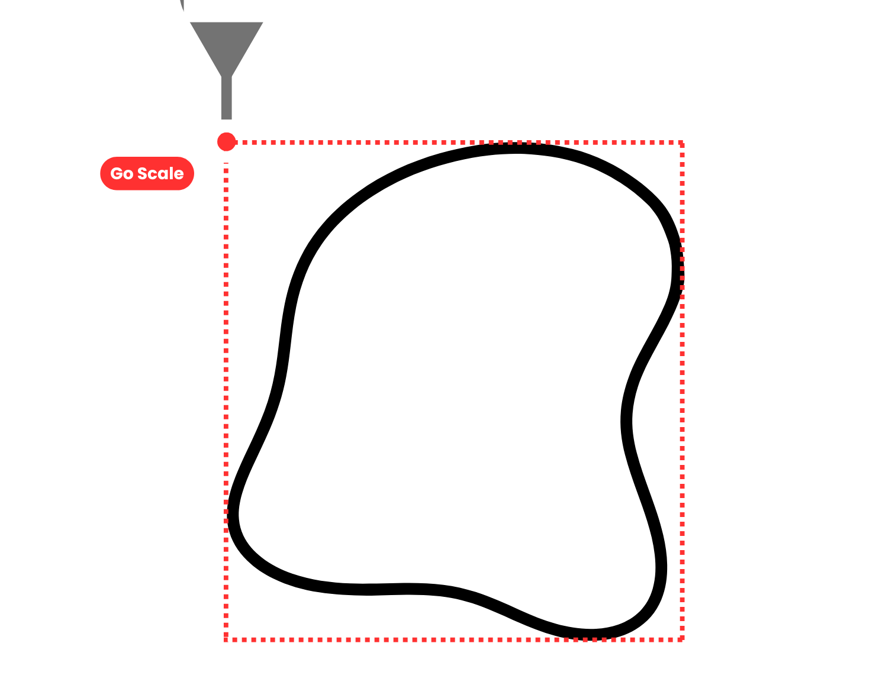

Sowftware para controlar la cortadora láser

El software **RdWorks** es un software de control y diseño específicamente creado para máquinas láser. Este es el software que ocupamos en Exploratec para controlar nuestra máquina AEON MIRA 9.

## Considerar:

### 1.Espacio de trabajo

El espacio de trabajo de RdWorks cuenta con distintas secciones, las cuales cumplen funciones diferenciadas. Para un mayor entendimiento a lo largo de este instructivo, se hará un breve repaso de estas secciones.

#### Barra de menú: Esta barra incluye las funciones más básicas del software, incluyendo Documento, Editar, Dibujar, Configurar y Ayuda, entre otras.
#### Barra del sistema: Este espacio permite realizar los comandos como Guardar, Zoom, Paso Anterior y Paso Posterior.
#### Barra de gráficos: Permite conocer y editar distintos aspectos de los objetos dentro del área de trabajo, como su ubicación, tamaño, ratios, etc.
#### Barra de edición: Incluye funciones básicas de diseño cómo dibujar líneas, dibujar polígonos, etc.
#### Área de trabajo: Es el área designada donde los vectores, ya sean importados o diseñados en el mismo programa, serán trabajados. Esta área refleja una vista proporcional de como se verá la cama de trabajo en la máquina AEON MIRA 9.
#### Panel de capas: El panel se divide en dos, la parte superior tiene un resumen de las capas según los colores asignados, el modo, el output y hide. La parte inferior contiene información más específica sobre cómo esa capa se comportará, particularmente información sobre la Velocidad, Poder Mínimo, Poder Maximo y la prioridad que tiene esa capa.
#### Barra de colores para capas: Sirve para asignar distintos colores a los objetos existentes del área de trabajo según la función que se le quiere dar a la máquina (corte o grabado).
#### Panel de control: Es la sección más relevante dentro de la función de la máquina ya que esta sirve no solo para dar inicio a los procesos de corte o grabado, sino que también para ver la escala que ocupará el corte/grabado, y para poner en pausa la máquina de necesitarlo en alguna parte del proceso.

### 2.Importar archivos
El software soporta archivos vectoriales como .dxf o .svg. También se acepta el formato de Illustrator 3 (formato antiguo de Illustrator, tutorial AQUÍ), siempre y cuando todos los elementos sean vectoriales o estén rasterizados (ej: vectorizar los textos, tutorial AQUÍ). 

Para importar estos archivos, primero hay que asegurarse que estos estén en el computador que se encuentra conectado a la máquina láser (puedes enviar tu archivo por correo o traer un pendrive con tu archivo). Una vez tu archivo se encuentra dentro del computador, deberás seguir los siguientes pasos:

1. En la barra de menú, hacer click a File(F).

2. En el menú que se desplegará abajo de File, iremos a la opción de Import y haremos click sobre él.

3. Al centro de la interfaz se desplegará una ventana la cual examinará la carpeta “Descargas” del equipo. Aquí podrás buscar tu archivo.

4. Una vez hagas click sobre un archivo, este desplegará una vista previa de los vectores que contiene el archivo. Estando seguro, puedes hacer click sobre “Open”, para completar la importación al software.

5. Los vectores se verán ahora en el área de trabajo. En el panel de capas verás las distintas capas de acción con las que se está trabajando en el archivo.

### 3.Pasos previos al corte/grabado

#### Seleccionar objetos
Un objeto seleccionado aparecerá con un color de línea diferente a los escogidos, además tendrá 8 puntos de control (cuadrados grises) en sus esquinas y laterales y una cruz magenta en el punto central de la figura.

Para seleccionar un objeto se puede hacer tocando el borde del objeto, o arrastrando el mouse por sobre el objeto, asegurándose de que todas las líneas están siendo “tomadas” por el cursor. 

Un objeto seleccionado se ve algo así:

#### Mover objetos
El uso eficiente del espacio de corte es fundamental para un uso correcto del material a cortar. Para mover objetos en el área de trabajo, primero debemos tener seleccionado el objeto el cual deseamos mover. Tomando desde el punto central ( x magenta) arrastraremos el objeto hasta el punto donde lo queremos mover. 

También, se puede hacer mediante la barra de gráficos, al cambiar los valores para las variables X e Y. Estos valores se definen desde el punto central de los objetos.

El área de trabajo tiene unas guías tipo reglas, las cuales permiten mover los objetos de manera más certera.

#### Suprimir objetos
Para eliminar objetos del área de trabajo basta con presionar la tecla “Supr” en el teclado del computador teniendo seleccionado el objeto. 

#### Transformar objetos
Las transformaciones que este software permite aplicar a objetos son 1. Escalar y 2. Rotar. Para ambas acciones hay que tener seleccionado el/los objetos/s que se desean transformar.

##### Escalar
Para escalar los objetos a un tamaño determinado, debemos ir a la barra de gráficos y editar los valores que se encuentran al lado de las flechas de medida. Debemos considerar que estas medidas se encuentran en milímetros.

Estas medidas son independientes la una de la otra, por lo tanto si solo editamos una de las medidas, el objeto se escalará independiente en su eje x que en su eje y. Para poder escalar uniformemente debemos activar el candado que se encuentra a un costado. 

##### Rotar
Rotar sirve para orientar los objetos de una manera más eficiente dentro del material a cortar/área de trabajo. Para rotar los objetos, basta con escribir el valor en grados que queremos rotar en el casillero aledaño a la figura de “rotar” en la barra gráficos.

#### Asignar potencia y velocidad
Mediante la Barra de colores para capas, seremos capaces de cambiar y/o ajustar los colores asignados a los objetos dentro de nuestra área de trabajo. Esto puede ser útil en casos donde el traspaso desde el software de diseño (en Illustrator) no se hizo de forma efectiva y se perdió la información correspondiente. 

Para cambiar efectivamente este color, se debe tener seleccionado uno o más objetos, y luego apretar el color de destino dentro de la barra. 
En Exploratec definimos tres colores base para las funciones de la máquina:
| Función  | Color  | Código RGB  |
| ------------- | ------------- | ------------- |
| Corte  | Negro  | 0,0,0  |
| Grabado Lineal  | Rojo  | 255, 0, 0  |
| Grabado Raster  | Azul  | 0, 0, 255  |

Estos deberían ser los únicos tres colores de los objetos en el área de trabajo.

Mediante el Panel de capas, seremos capaces de asignar distintos valores para la potencia y velocidad de los cortes y grabados para los distintos colores de capa.

Estos son valores que se deben corroborar con el técnico encargado, pero en términos simples, a mayor potencia y menor velocidad se crean cortes más profundos y a menor potencia y mayor velocidad se crean cortes más superficiales, ideal para hacer grabados.

### 4.Go Scale y Start
El último proceso antes de cortar es asegurarse que lo que deseamos cortar calze dentro de nuestro material. Para eso podemos usar la herramienta Go Scale, ubicada en el Panel de Control. 

Go Scale hará que la máquina “dibuje” con el cabezal el rectángulo que encapsule todos los objetos que se quieran cortar sobre la mesa de trabajo de la máquina, tomando como alto y ancho las medidas total que tome la figura o las figuras que se desean cortar.

Una vez ya tenemos claro que lo que queremos cortar cabe en nuestro material, debemos simplemente presionar el botón de Start dentro del panel de control para dar inicio al corte o grabado que deseamos realizar. Esto accionara que la máquina active el láser y comienze a desbastar el material. 

